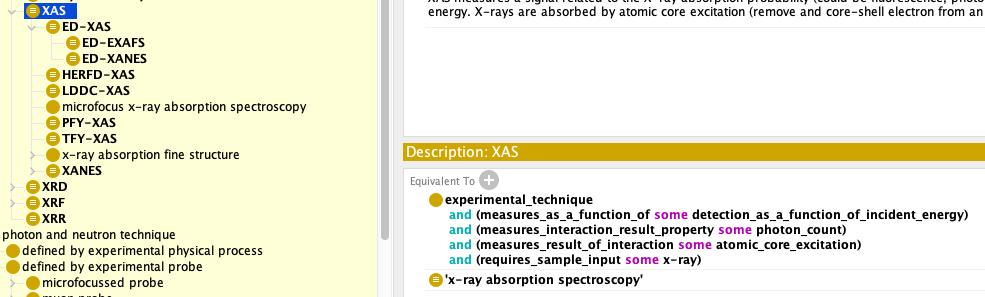
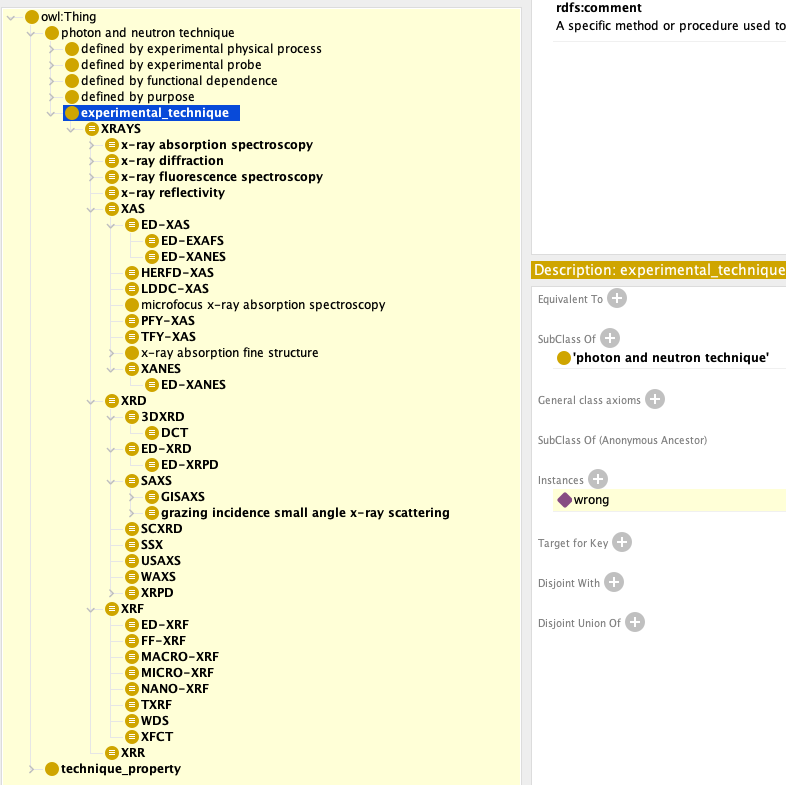
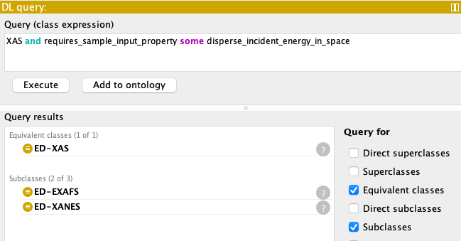
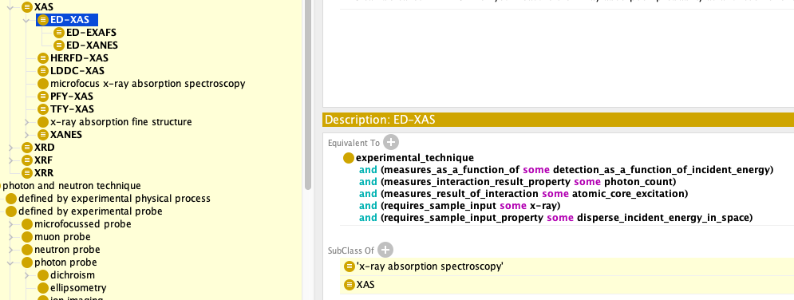
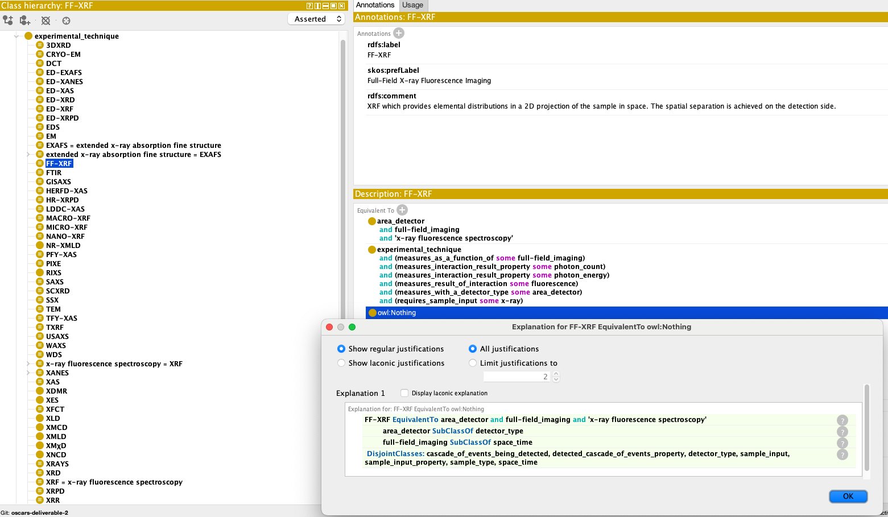
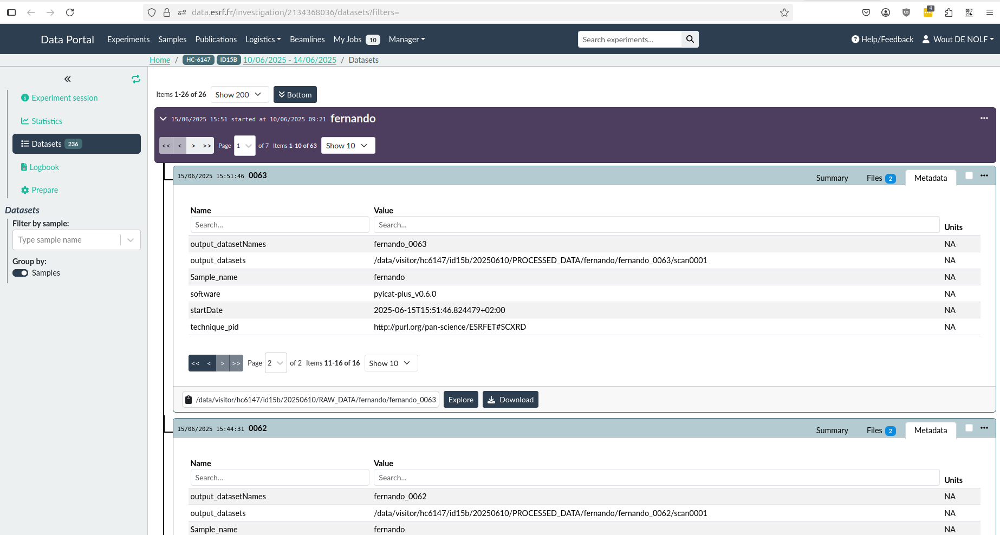

# ESRF Ontology for OSCARS project deliverable 2

The _ESRF Ontologies_ project provides ontologies related to [ESRF](https://esrf.fr/) data acquisition.

Ontologies:

- _ESRFET_ is an ontology of experimental techniques used at the ESRF connected to
  the [PaNET](https://doi.org/10.5281/zenodo.4806026) ontology.

Python API:

- Generate technique metadata for ESRF data producers to save in [NeXus-compliant](https://www.nexusformat.org/) HDF5 and the [ESRF data portal](https://data.esrf.fr).

---

## Getting started

Install from pypi

```bash
pip install esrf-ontologies
```

Retrieve technique metadata for one or more techniques

```python
from esrf_ontologies import technique

technique_metadata = technique.get_technique_metadata("XAS", "XRF")
dataset_metadata = technique_metadata.get_dataset_metadata()
scan_metadata = technique_metadata.get_scan_metadata()
```

## Documentation

https://esrf-ontologies.readthedocs.io
## Steps taken
## Progress report

- **New public github repository created**

  - A dedicated GitHub organisation (_pan-ontologies/esrf-ontologies_) now hosts ESRFET so that external partners can clone, fork or raise issues without VPN access to the facility.

  - Earlier snapshots (incl. the first deliverable, 31 Dec 2024) remain on the internal GitLab for provenance and reproducibility.

- **Technique creation continues via _differential definitions_**

  - Each new technique is expressed as the **minimal intersection of building-blocks** that distinguishes it from its siblings – the recommended “differential” style [indico.esrf.fr](https://indico.esrf.fr/event/114/contributions/764/attachments/558/1078/2024_09_NOBUGS_techniques_ontology_WDN.pdf).

- **`Building-blocks were renamed technique_property`**:

  - this helps to emphasise their role as reusable predicates rather than hand-made subtaxonomies.

- **Re-organisation of technique properties**

  - Introduced **high-level categories** to be able to add object_properties and provide range to them using these categories.

  - For each category we minted an **object property** whose **range** is that category – enabling the reasoner to detect category misuse through domain/range checking.

  - This allows object_properties to be more specific and the reasoner to better safeguard the semantics in the technique definitions.

  - Obsolete or never-referenced properties were **merged or deprecated**, eliminating dead load.

- **Switch to property-based definitions**

  - Techniques now reference properties (e.g. `esrf:measuresResultOfInteraction some esrf:diffraction`) instead of being direct subclasses of the property class itself.

  - This removes an incorrect _class–instance conflation_ and allows us to declare the two branches **disjoint**, a powerful debugging cue for incoherent axioms. ([OntoTips](https://douroucouli.wordpress.com/2018/08/03/debugging-ontologies-using-owl-reasoning-part-1-basics-and-disjoint-classes-axioms/), [semantic interoperability](https://bmcmedinformdecismak.biomedcentral.com/articles/10.1186/s12911-020-01336-2))

- **Disjoint axioms added**

  - `esrf:experimental_technique` **disjointWith** `esrf:technique_property` in order to prevent accidental mixing of semantics and enforces object-property based definitions.

  - Sibling categories under `technique_property` also declared **mutually disjoint**.

  - Running the reasoner exposed **7 invalid technique definitions** (out of ~40) that silently violated the new constraints; they were fixed, proving the value of disjointness as a QA mechanism.

- **PaNET linkage**

  - Every ESRFET term is mapped to a PaNET identifier, keeping both taxonomies in sync and ensuring global discoverability.

---

### Why these changes matter

1.  **Differential axioms** keep definitions readable and minimise maintenance when common blocks evolve.

2.  **Object-property driven modelling** enables automatic **re-classification** and cleaner SPARQL queries, while disjointness catches hidden contradictions during reasoning.

3.  Mapping to NeXUS application definition was given using the appropriete object_property whenever possible as a proof of concept.

4.  Mapping to PaNET ensures ESRF data remain FAIR and interoperable across all European photon & neutron facilities.

---

## Reviwing the PaNET ontology

The PaNET ontology was reviewed before the recent changes that follow some of these directions by adding object_properties moving PaNET from being a taxonomy closer to a complete ontology. The recommendations for PaNET are the following:

- **Start with competency questions**

  - Draft 5-10 user-oriented questions that the ontology must answer (e.g. _“Which techniques use neutron probes and measure time-resolved signals?”_) – a standard scoping method in ontology engineering. ([Ontology competency questions](https://tishchungoora.medium.com/ontology-competency-questions-3d213eb08d33), [Analysis of Ontology Competency Questions](https://www.sciencedirect.com/science/article/abs/pii/S1570826819300617))

  - Let the questions drive modelling choices and shape which properties are required.

- **Anchor design in real applications**

  - Build at least one runnable demo (e.g. a beamline recommender or search form) to keep modelling grounded in user needs ([PaNET Ontology-Based Beamline Finder](https://indico.egi.eu/event/6638/contributions/20451/)).

  - Document every SPARQL query the demo needs; these can become regression tests in CI/CD.

- **Reuse and interlink**

  - Prefer `owl:equivalentClass` / `skos:exactMatch` to external, _stable_ ontologies (e.g. QUDT for units, PROV-O for provenance) rather than ad-hoc subclasses

  - Map each PaNET technique to its NeXus application definition where available (e.g. `NXarpes` ⇔ ARPES concept) so data validation can reference a single ID ([nexusformat](https://manual.nexusformat.org/classes/applications/NXarpes.html)).

- **Keep the taxonomy clean**

  - Separate _real techniques_ from _organisational categories_; categories should never appear as objects of `hasTechnique` in data sets.

  - Apply the **“one subclass” smell** rule: if a parent class has only one child, revisit the design – it’s usually a sign of unnecessary depth ([stanford ontology 101](https://protege.stanford.edu/publications/ontology_development/ontology101.pdf)).

- **Four orthogonal facets**

  - Provide parallel **equivalentClass definitions** for each facet so integrators can query whichever dimension they need.

- **Define new technique_properties only when used**

  - CI script lists unused classes & properties and blocks the merge if the number grows above zero.

- **Authoritative reference model**

  - Commit to never deleting URIs – mark `owl:deprecated true` and provide `dct:isReplacedBy` instead.

  - Treat PaNET as the canonical vocabulary; facility extensions (ESRFET, PETRAET, DiamondET) should link via equivalence or subclassing.

- **Continuous integration / delivery**

  - Pipeline loads _previous_ and _new_ PaNET, classifies both, and fails on:<br> • new unsatisfiable classes<br> • hierarchy shifts of released terms<br> • techniques without prefLabel/comment<br>

- **Use best-practice patterns**

  - Employ `EquivalentTo` more to provide _necessary & sufficient_ definitions, and `SubClassOf` for asserted hierarchy only when a definition is not applicable.
  - After providing the definitions allow the reasoner to create the taxonomy in order to avoid mistakes that always exist in manual subclassing ([EquivalentClass vs. SubClassOf](https://stackoverflow.com/questions/4192435/owls-equivalentclass-vs-subclassof), [Equivalent or SubClass](https://henrietteharmse.com/2021/12/23/equivalentto-versus-subclassof/)).

  - Keep labels concise; add long natural-language detail into `rdfs:comment` explaining semantics and the modeling approach taken.

## Protege printsceens highlighting important changes

- **Import NeXUS and PaNET**

  The imported ontologies: PaNET and NeXUS are shown in the following image. The goal is to create mappings where possible for all techniques with both ontologies.

  - For PaNET we use the official URL and rely on purl.org redirection in order to import the ontology.

  - For NeXUS a local file is imported till the official URL is enriched with the needed redirection information.


- **Mapping to PaNET**

  In the following we can see the mappings to the PaNET ontology.
  First of all the highest level and most abstract techiques are mapped to the existing PaNET techniques.



Another important mapping to the PaNET ontology is depicted below where the ESRFET:experimental_technique was made a subclass of the PaNET:photon_and_neutron_technique. This relatioship can and probably should be further extended by making it equivalent_to the photon_techiques from the PaNET side.



- **DL-queries based on building-blocks**
  In the following image an example DL query demonstrates the way technique_properties can be used as building blocks to explore the differences, similariries and subclassing between techniques.



- **Reasoning and deferential definition**
  The power of reasoning and the modular, differential approach we selected for providing definitions is demonstrated in the following image. ED-XAS is infered to have as a superclass the PaNET:'x-ray absorption spectroscopy' along with the ESRFET:XAS.None of them was manually appointed but the reasoner was able to understand the relation to XAS due to the differential definition and then also apply it to the equivalent PaNET technique.



- **Reasoning located obsolete definitions**
  Another important and awaited inference is depicted in the following image. The reasoner was able to deduce that both definitions (old in deliverable 1 and the new with object_properties) cannot coexist. That became obvious when disjoins were added to the ontology and explained in the message of the reasoner which explains while FF-XRF equals owl:Nothing the way it is defined.



- **Reasoning located missing building blocks or erroneous definitions**
  Finally the differential definition and the reasoner allow us to pinpoint techniques that are infered to be equal while they should not. In this case adding another technique_property or changing the definitions is needed.


## Using the ontology in production

The python project was installed with success to ID15b as a demonstartion and following that it was delivered to the BCU (Beamline Control Unit) for mass installation in all beamlines. As the project continues and more techniques are added they will be imediatelly available from the ontology in each beamline as it is totally decoupled and synchronized with the evolving ontology. A printscreen from the ESRF data-portal follows where the ESRFET URI of the technique used is depicted.


