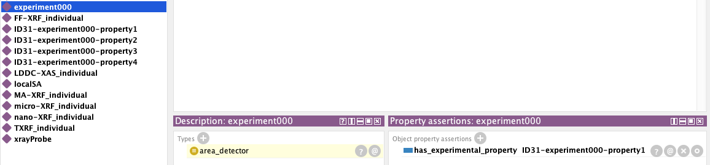
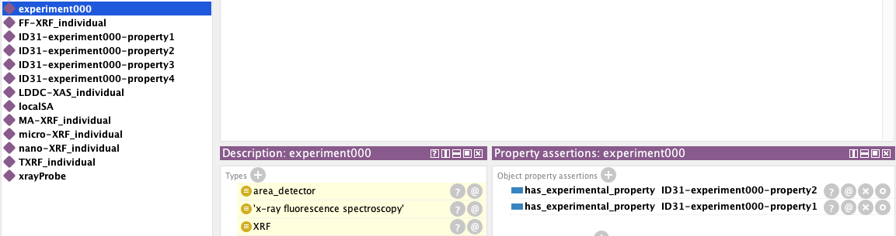
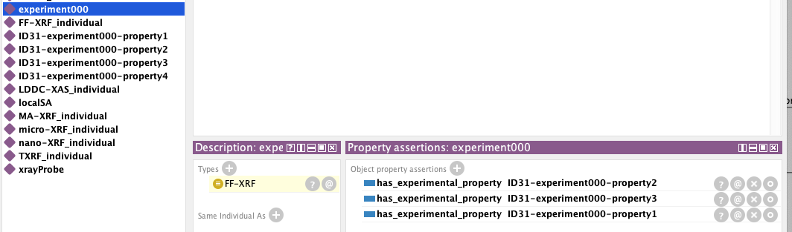

# ESRF Ontology for Oscars

This repository contains the first draft of the ESRF Ontology, which defines 11 techniques from two major families: **XAS (X-ray Absorption Spectroscopy)** and **XRF (X-ray Fluorescence)**.

## Goals

- **Demonstrate the approach**: Show how these techniques can be defined using fundamental building blocks.
- **Facilitate differentiation**: Use these definitions to distinguish between techniques clearly and effectively.
- **Connect to PaNET**: Find the equivelances in the PaNET ontology.

---

## Building the Ontology

### Steps:

1. **Identify Use Cases**:

   - Define how the ontology will be used and what specific needs it will address.
   - Formulate questions the ontology should answer using a reasoner or SPARQL/SWRL queries.

2. **Develop Concepts**:

   - Begin with sentences describing the concepts of the ontology.
   - Extract key concepts as **classes** and identify their descriptors as **building blocks**.

3. **Define Classes**:

   - Use differential definitions by combining building blocks to define classes.
   - Gradually refine these definitions, adding more building blocks to distinguish between techniques.

4. **Iterative Refinement**:

   - Start with simple definitions and expand them based on the need to differentiate techniques.
   - Use the reasoner continuously during development to understand the implications of the modeling approach.

5. **Organize Building Blocks**:
   - Group building blocks into **categories** and create object properties for better organization.
   - Use these categories and properties to craft meaningful sentences that describe the techniques, rather than relying solely on taxonomies.

---

## Semantic Negotiations

- **Document Reasoning**:
  - Clearly explain the rationale behind the modeling approach for human understanding.
- **Visual Aids**:

  - Include images in this repository to illustrate the ontology's structure and definitions.
  - Directly reference these images in the ontology to enhance comprehension.

- **Interlink with Other Ontologies**:
  - Identify relationships with external ontologies and document selected connections (e.g., `owl:equivalentTo`, `skos:broader`, etc.).

---

## Why Build Gradually?

- The goal is not to create exhaustive definitions initially.
- Focus on differentiating techniques incrementally, adding complexity as needed to refine the ontology.

### Working with building blocks and differential meaning in protege:

## DL-query tab

In the following image a query has been built using the Description-Logic (DL) query tab in protege.

- Using such queries it is easy to infer if more than technique has the same descrition with any other using the building blocks.
- Equivalent class has to contain always one technique or else a new building block needs to be introduced to differentiate between the techniques.
- The subclasses and superclasses can easily be examined in this tab to make sure everything makes sense.

## OntoGraf graphs for spotting the differences

In the following graphs we can see the building blocks that differentiate the techiniques included in this deliverable.
Most common building blocks have been removed to make the differentiating building blocks clearer.

XAS techniques

XRF techniques

## Example for connecting ontologies

In order to demonstrate the use of our ontology we need to connect it with other ontologies and allow the reasoner infer some
new knowledge.

Lets assume we have an experimental ontology that has properties that can be used to describe an experiment.
These properties are very close tho the concepts defined in NeXUS standard since it describes a file structure
of properies that the experiments would need to save.
Here we define such properties and their individuals:

      <ClassAssertion>
         <Class IRI="#property_1"/>
         <NamedIndividual IRI="#ID31-experiment000-property1"/>
      </ClassAssertion>
      <ClassAssertion>
         <Class IRI="#property_2"/>
         <NamedIndividual IRI="#ID31-experiment000-property2"/>
      </ClassAssertion>
      <ClassAssertion>
         <Class IRI="#property_3"/>
         <NamedIndividual IRI="#ID31-experiment000-property3"/>
      </ClassAssertion>
      <ClassAssertion>
         <Class IRI="#property_4"/>
         <NamedIndividual IRI="#ID31-experiment000-property4"/>
      </ClassAssertion>

We also define the following object property that is connecting a technique_property used to describe techniques
to a specific experiment_property through the `Domain` and `Range` properties.

      <Declaration>
         <ObjectProperty IRI="#has_experimental_property"/>
      </Declaration>
      <ObjectPropertyDomain>
         <ObjectProperty IRI="#has_experimental_property"/>
         <Class IRI="#technique_property"/>
      </ObjectPropertyDomain>
      <ObjectPropertyRange>
         <ObjectProperty IRI="#has_experimental_property"/>
         <Class IRI="#experiment_property"/>
      </ObjectPropertyRange>

Then we create the appropriete `individuals` to use the object property we created:

      <ObjectPropertyAssertion>
         <ObjectProperty IRI="#has_experimental_property"/>
         <NamedIndividual IRI="#experiment000"/>
         <NamedIndividual IRI="#ID31-experiment000-property1"/>
      </ObjectPropertyAssertion>
      <ObjectPropertyAssertion>
         <ObjectProperty IRI="#has_experimental_property"/>
         <NamedIndividual IRI="#experiment000"/>
         <NamedIndividual IRI="#ID31-experiment000-property2"/>
      </ObjectPropertyAssertion>
      <ObjectPropertyAssertion>
         <ObjectProperty IRI="#has_experimental_property"/>
         <NamedIndividual IRI="#experiment000"/>
         <NamedIndividual IRI="#ID31-experiment000-property3"/>
      </ObjectPropertyAssertion>

In the following snippets we see the appointment of these experimental properties in the definition of
techniques like saying "if you use this specific kind of detector then you use this technique":

      <EquivalentClasses>
      <Class IRI="http://purl.org/pan-science/PaNET/PaNET01095"/>
      <ObjectSomeValuesFrom>
      <ObjectProperty IRI="#has_experimental_property"/>
      <Class IRI="#property_2"/>
      </ObjectSomeValuesFrom>
      </EquivalentClasses>

      <EquivalentClasses>
         <Class IRI="#area_detector"/>
         <ObjectIntersectionOf>
            <Class IRI="#technique_property"/>
            <ObjectSomeValuesFrom>
                  <ObjectProperty IRI="#has_experimental_property"/>
                  <Class IRI="#property_1"/>
            </ObjectSomeValuesFrom>
         </ObjectIntersectionOf>
      </EquivalentClasses>

      <EquivalentClasses>
         <Class IRI="#full-field_imaging"/>
         <ObjectSomeValuesFrom>
            <ObjectProperty IRI="#has_experimental_property"/>
            <Class IRI="#property_3"/>
         </ObjectSomeValuesFrom>
      </EquivalentClasses>

With the above we can see the reasoner infers different things for a given individual as shown in the following steps:

1. Initialy it was infered to be a `detector`
   

2. With the addition of another property the reasoner went deaper into infering the individual as a `technique` as well:
   

3. Finally when adding the final property the reasoner was able to infer the `exact technique` used in this experiment:
   
