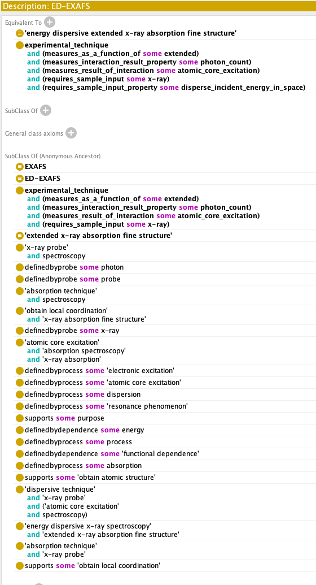
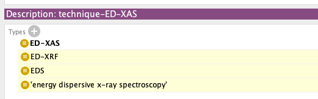
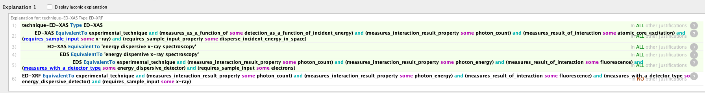
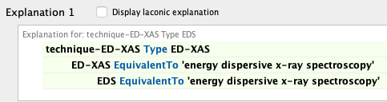
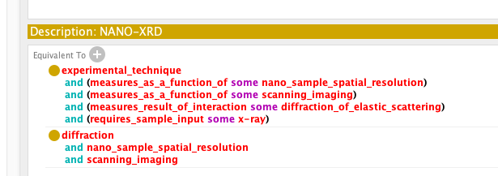
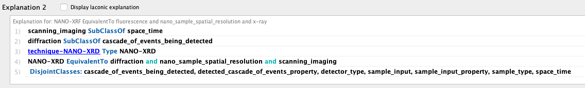
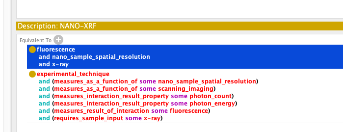
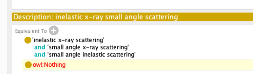
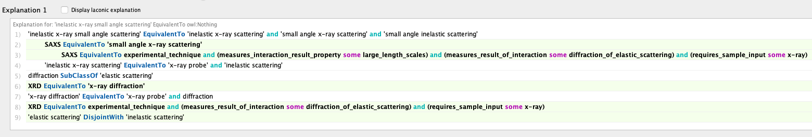

# ESRF Ontologies OSCARS deliverable 3

## Capturing all ESRF techniques

We were able to identify 78 techniques that cover every beamline in ESRF. Most of these techniques
were given a definition using our technique properties that were also extended in order to provide us
with the descriptive power we need.

For the othertechniques that still miss a proper differential definition requests to scientists were
made so as to have their input in adding new technique properties that would allow them to capture
the definitions for their techniques.

The difficult part in this process other than the availability of the scientists is the common
understanding of used concepts in the ontology. This boils down to understanding first of all the
modeling approach that we choose in our ontology. To this the documentation we already have explaining
the modeling approach using also figures (as analyzed in deliverable 2) was very useful.

During this process though we realized that also some of our properties need to have their own human
accesible descriptions at least so as to be easier, for all ontology-users, to understand them and
use them or even create new.

For some beamlines we accept requests for adding new techniques (eg...) or for specializing existing ones.

## Adding example individuals for all techniques

Add example individuals to each experimental technique and demonstrate reasoning on
the produced ontology. Explain the need to addindividuals for reasoning to work...

## PaNET mapping: reasoning and conflict resolution

In this version an assertion was added to some experimental techniques to connect them to the corresponding
techniques in the potentially extended PaNET ontology.

- all available obvious mapping were added
- a workflow for the mapping was also suggested

## Merge request example for mapping to PaNET

A merge request is used for a number of techniques each time like the following
https://github.com/pan-ontologies/esrf-ontologies/pull/76

that lead to discussions like the following
https://github.com/pan-ontologies/esrf-ontologies/pull/76#issuecomment-3694950704

In specific the ED-EXAFS was suggested for mapping to `"extended x-ray absorption fine structure"` which
makes sense lexically. For the mapping between 2 ontology concepts he have to make sure that they are
semantically equivalent. This means that we need to examine the actual meaning provided within each
ontology.

For this we need to take all ancestors of the concept from the PaNET taxonomy and make sure non of them
is disjoined in ontology terms to the concept we need to map. This can be done through the DL-query in
protege or through the `Anonymous Ancestors` which provides us with all ancestors of the `"extended x-ray absorption fine structure"` along with all ancestors of ED-EXAFS as seen below:

The advantage of the `Anonymous ancestors` is that it includes all equivalent definitions that form an
anonymous class even if we have never defined one like this.

 Connect the new ESRF-ET concepts to NeXus Vocabulary items of the corresponding
Application Definitions wherever applicable

- One way to connect the NEXUS ontology to the ESRFET ontology was demonstrated in deliverable 2 where the application definition
  was considered a subclass of a specific family of techniques. No other connection between the existing
  concepts is applicable for now. To this direction though an effort was made to lighten the NEXUS ontology from the
  burden of the file-folder structure so as to capture other important semantics. Specifically the use of SHACL was investigated
  and demostrated as a more appropriete way of capturing rescrictions regarding structure and types. Should this approach
  be adopted the NEXUS ontology would be easier to absorb knowledge included in the scientific comments of each class. This
  would bring it right next to the building blocks of our ESRFET semantically and mapping would be a lot more obvious.

 Use of ESRF-ET ontology concepts in data portal for 20 techniques to annotate
experiments

- request data from the beamlines

## The ED-XAS equivalence inconsistency

In the following example we see how the example individual helped catch an inconcistency. In specific
the resoner revealed that the individual: `technique-ED-XAS` had 3 more types other the asserted one
which was the `ED-XAR` class. The reasoner added also `ED-XRF` and it's PaNET equivalent
`energy dispersive x-ray spectroscopy` as seen in the figure below.

The reasoner also provided us with the following explanation for the above assertions.

## The NANO-XRD inconsistency with the double definition

## The NANO-XRF inconsistency with the double definition

## Inelastic vs elastic inconsistency

