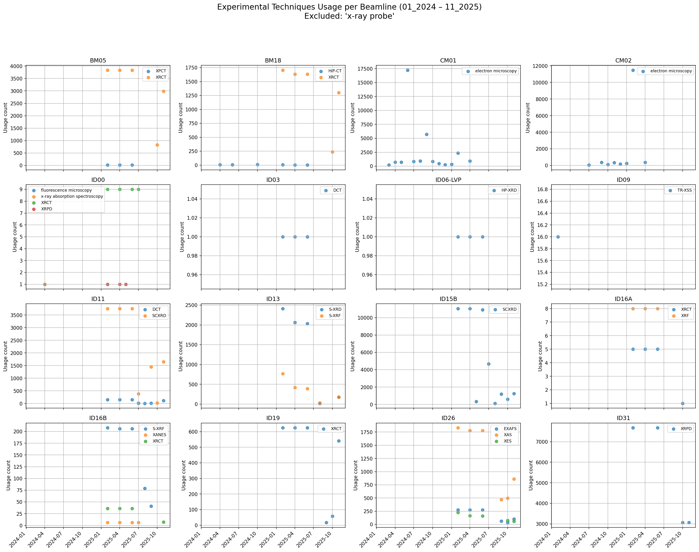

# ESRF Ontologies OSCARS deliverable 3

## Capturing all ESRF techniques

We identified **78 experimental techniques** covering every ESRF beamline and provided differential definitions using ESRFET technique_properties. Where definitions were missing, we engaged beamline scientists to propose new building-blocks (properties, ranges, interaction outcomes) required to express the technique unambiguously. This follows OWL 2 best practice: define classes intensionally (via necessary/sufficient restrictions) so that reasoners can classify techniques automatically and detect modelling errors.

To reduce misinterpretation, we complemented the formal axioms with human-readable annotations: **labels, comments, scope notes** on both techniques and technique_properties, and we documented the modelling pattern (what “measures_as_a_function_of”, “requires_sample_input”, etc. mean in practice, with short examples). This makes the ontology more usable in tooling and downstream portals while remaining machine-actionable. (SKOS-style labelling patterns and notes are widely used for this purpose.)

We also added **disjointness** between technique and technique_property (and between property categories) to force reasoners to surface categorization mistakes early, which already helped catch several erroneous definitions during this period. (This is a standard consistency-checking technique in OWL ontologies.)

For some beamlines, we are open to new technique proposals or specializations (subclasses) when justified by stable practice on the instrument; these enter the same **differential-definition workflow** described below.

## Adding example individuals for all techniques

We attached minimal **example individuals** to each technique (e.g., a toy experiment instance with the relevant object/data property assertions). This is not to turn the ontology into a dataset, but to make inference demonstrable and to **catch open-world pitfalls** (e.g., unintended satisfiability, missing necessary conditions). In practice, the individual test-cases made it easier to see when definitions **collapsed distinct techniques or leaked into siblings**. (Open-world reasoning explains why an individual can be classified under a superclass even if some expected facts are not asserted.) We will later examine how the individuals helped the reasoner surface some inconsistencies.

## PaNET mapping: reasoning and conflict resolution

We asserted mappings from ESRFET techniques to PaNET where an **equivalent meaning** exists (not just lexical similarity). The workflow:

1. Propose mapping (**equivalentClass** or **closeMatch**) with a short justification. For this deliverable the equivalent class was used and for the techniques that there was a closeMatch a comment was inserted for the scientist to have a guide when examining PaNET.

2. Compare all (anonymous) **ancestors** and **necessary conditions** on both sides (Protegé DL Query + “Anonymous Ancestors”).

3. If constraints conflict (e.g., PaNET implies a detection mode that ESRFET explicitly excludes), downgrade to broader/narrower mapping or open an issue upstream.

4. We track these via PRs and issues in both repos, keeping the **discussion public** to converge on stable semantics. The goal is to use these discussions in the ontology later for **reference** on how the mapping was defined by experts in the domain.

### Merge request example for mapping to PaNET

A single PR like [this one](https://github.com/pan-ontologies/esrf-ontologies/pull/76) can bundle a set of coherent mappings. Those can lead to discussions like this: [ED-EXAFS discussion](https://github.com/pan-ontologies/esrf-ontologies/pull/76#issuecomment-3694950704). The key is demonstrating **semantic** equivalence (axioms) rather than **lexical** equivalence (labels).

In specific the ED-EXAFS was suggested for mapping to **_extended x-ray absorption fine structure_** which makes sense lexically. For the mapping between 2 ontology concepts he have to make sure that they are semantically equivalent. This means that we need to examine the actual meaning provided within each ontology.

For this we need to take all ancestors of the concept from the PaNET taxonomy and make sure non of them is disjoined in ontology terms to the concept we need to map. This can be done through the DL-query in protege or through the **Anonymous Ancestors** which provides us with all ancestors of the **_extended x-ray absorption fine structure_** along with all ancestors of ED-EXAFS as seen below:

The advantage of the `Anonymous ancestors` is that it includes all equivalent definitions that form an anonymous class even if we have never defined one like this.

## NeXus: connections and restructuring

One way to connect the NEXUS ontology to the ESRFET ontology was demonstrated in deliverable 2 where the application definition was considered a subclass of a specific family of techniques. No other connection between the existing concepts is applicable for now.

To this direction though we found that parts of NeXus encode **file-structure constraints** (what must appear where) mixed with scientific intent. Our proposal is to **factor structural constraints into SHACL** shapes (validation layer) and reserve **OWL** for domain semantics (classes/properties and their logic). That separation improves reasoning quality and keeps file validation explicit and testable.

Specifically the use of **SHACL was investigated and demonstrated** as a more appropriate way of capturing restrictions regarding structure and types. Should this approach be adopted the NEXUS ontology would be easier to absorb knowledge included in the scientific comments of each class. This would bring it right next to the building blocks of our ESRFET semantically and mapping would be a lot more obvious.

Below is the given example for the **shape for NXarpes NXentry**:

    @prefix rdf:   <http://www.w3.org/1999/02/22-rdf-syntax-ns#> .
    @prefix rdfs:  <http://www.w3.org/2000/01/rdf-schema#> .
    @prefix xsd:   <http://www.w3.org/2001/XMLSchema#> .
    @prefix sh:    <http://www.w3.org/ns/shacl#> .
    @prefix nexus: <http://purl.org/nexus/def#> .
    #############################
    /# Shape for NXarpes NXentry #
    #############################
    nexus:NXarpesEntryShape
      a sh:NodeShape ;
      rdfs:label "NXarpes NXentry shape"@en ;

      /#Apply this shape to all NXentry instances
      sh:targetClass nexus:NXentry ;

      /# "definition" must exist once and equal "NXarpes"
      sh:property [
        sh:path nexus:definition ;
        sh:minCount 1 ;
        sh:maxCount 1 ;
        sh:datatype xsd:string ;
        sh:hasValue "NXarpes" ;
      ] ;

      /# Exactly one instrument group, typed NXinstrument
      sh:property [
        sh:path nexus:instrument ;
        sh:minCount 1 ;
        sh:maxCount 1 ;
        sh:class nexus:NXinstrument ;
      ] ;

      /# Exactly one sample group, typed NXsample
      sh:property [
        sh:path nexus:sample ;
        sh:minCount 1 ;
        sh:maxCount 1 ;
        sh:class nexus:NXsample ;
      ] ;

      /# Exactly one data group, typed NXdata
      sh:property [
        sh:path nexus:data ;
        sh:minCount 1 ;
        sh:maxCount 1 ;
        sh:class nexus:NXdata ;
      ] ;

      /# One title (string)
      sh:property [
        sh:path nexus:title ;
        sh:minCount 1 ;
        sh:maxCount 1 ;
        sh:datatype xsd:string ;
      ] ;

      /# One start_time (xsd:dateTime)
      sh:property [
        sh:path nexus:start_time ;
        sh:minCount 1 ;
        sh:maxCount 1 ;
        sh:datatype xsd:dateTime ;
      ] .

## Use of ESRF-ET ontology concepts in the ESRF Data Portal

Within our repository in github there is also a python project hosted that **uses the ESRF-ET** in order to provide an **API that the beamlines can directly use to annotate their experiments** with the appropriate technique using the ESRF-ET URL. This is now available for all beamlines that can easily use the ontology through this python library implemented in all beamlines.

That led to a fast adoption of the ontology concepts as we can see in the following compilation of graphs from many beamlines.

## The ED-XAS equivalence inconsistency

In the following example we see how the **example individual helped catch an inconsistency**. In specific the reasoner revealed that the individual: `technique-ED-XAS` had 3 more types other the asserted one which was the `ED-XAR` class. The reasoner added also `ED-XRF` and it's PaNET equivalent `energy dispersive x-ray spectroscopy` as seen in the figure below.

The reasoner also provided us with the following explanation for the above assertions. Here it is more clear that an equivalent of **EDS** and **ED-XAS** was misleading and should be removed.

And here is the deeper explanation on how this equivalence came to be taken from the inferred definitions of ED-XAS and EDS.

## The NANO-XRD inconsistency with the double definition

Below we have the example of a mixed definition that is always causing inconsistencies. In specific for NANO-XRD we used a combined definition incorporating both object properties and direct classes from our technique_properties. While this approach seems promising regarding knowledge fusion and towards creating mixed expressions it ends-up in creating inconsistencies that the reasoner was able to locate.

The explanation below pinpoints that due to the disjointedness it is not possible to use classes without their object properties anymore. All old definitions from deliverable one and two were replaced by the new object_property based according to similar errors surfaced by the reasoner.

## The NANO-XRF inconsistency with the double definition

Another example for the mixed definitions is shown below for the NANO-XRF technique that mistakenly still had the old definition. The same happened to some techniques that had the old-kind of definitions in PaNET. In this case that prevented us from mapping our technique properties since in PaNET they are used as abstract classes with the taxonomy and not as building-blocks to define techniques.

## Inelastic vs elastic inconsistency

Another case where the power of the reasoner was demonstrated was the wrong definition given to **_elastic x-ray small angle scattering_**.

And here is the reasoner explanation for the inconsistency:

